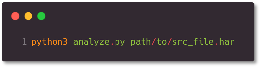
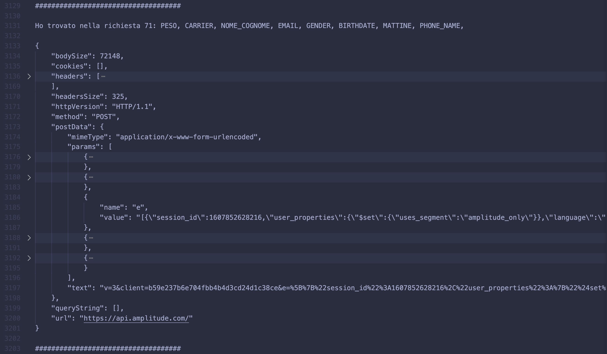

# progReti

* Lanciare mitmdump tramite il seguente comando: 'mitmdump -s ./har_dump.py --set hardump=./App_OS_Version_GPS.har'
* Spostare il file appena creato nella cartella results_har.
* Lanciare l'analizzatore grafico con il comando 'python3 GUIAnalyze.py' e selezionare il file .har che si vuole analizzare.
    Oppure lanciare il comando 'python3 analyze.py path/to/src_file.har'.

## Sniffing e generazione har files

|               Menu                    |               Demo                   |
|               :---:                   |               :---:                  |
|      |      |

* Aprire il file .txt appena generato nella cartella results_txt e analizzarlo richiesta per richiesta.

## Sniffing e generazione har files

|               Menu                    |
|               :---:                   |
|      |